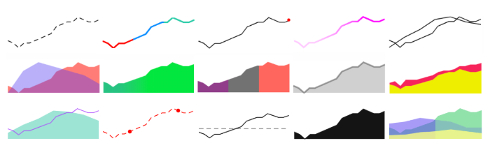

# scintilla → react sparklines



[](https://github.com/amoradi/scintilla/actions/workflows/node.js.yml)

---

## Demo

See: https://amoradi.github.io/scintilla

Donate:
- BTC: `bc1qejny2ddag2phmyndq78hq2uxuxkh38t5v4k9mt`
- ETH: `0x16cC9a598a3817F32c5B794C9391B14Ff93bd87e`

## Install

```bash
$ yarn add scintilla
$ or
$ npm install scintilla --save
```

## Quick Start

```jsx
import React from "react";
import { Frame, Line } from "scintilla";

const RedLine = () => (
  {/* wrap sparkline in a container to constrain width */}
  <div style={{ width: '100px' }}>
    <Frame>
      <Line
        data={[40, 50, 60, 70]}
        stroke={{
          color: { solid: [255, 0, 0, 1] },
          width: 2,
          style: "solid"
        }}
      />
    </Frame>
  <div>
);
```

## Features

- composeable: mix and match as many `Line`'s within a single `Frame`
- `SVG`-based
- flexible intra-data color options
- fluid width. Wrap `Frame` in your own container to constrain width.

## API

See: https://amoradi.github.io/scintilla/documentation

**Types**

```ts
type Color = {
  gradient?: RGBA | RGBA[];
  solid?: RGBA | RGBA[];
};
```

```ts
type RGBA = [0-255, 0-255, 0-255, 0-1]
```

```ts
type Stroke = {
  width: number;
  style: "dash" | "solid";
  color: Color;
};
```

**Components**

### `<Frame />`

Responsive container for all `data`-needy child components. Wrap `Frame` in your own container to constrain width.

- **`height?: number`**
  Optionally specify height in pixels. Defaults to `50px`.

- **`yRange?: [min<number>, max<number>]`**
  Optionally plot `children` components with this y axis constraint.

**Example**

```jsx
<div style={{ width: "100px" }}>
  <Frame height={100} yRange={[0, 500]}>
    <Line />
  </Frame>
</div>
```

---

### `<Line />`

Plot your series data as a line. Style line with `stroke`, `fill` or both.

- **`data: number[]`**
  The list of `y` data to plot.

- **`stroke?: Stroke`**
  Set `width` in pixels, `style` as `'dash'` or `'solid'` and color option.

- **`fill?: Color`**
  Solid or gradient fill, with one or many colors. Fills area from data line to bottom axis.

**Example**

```jsx
<div style={{ width: "100px" }}>
  <Frame>
    <Line
      data={[-1, 2, 6, 9, 11, 21]}
      stroke={{
        width: 1,
        style: "dash",
        color: {
          solid: [
            [255, 0, 0, 0.25],
            [255, 0, 0, 0.5],
            [255, 0, 0, 0.1]
          ]
        }
      }}
      fill={{
        gradient: [
          [255, 0, 0, 0.1],
          [255, 0, 0, 1]
        ]
      }}
    />
  </Frame>
</div>
```

---

### `<Marker />`

Circular marker positioned at `data[index]`. Make as many as you like.

- **`data: number[]`**
  The list of `y` data `Marker` will render from.

- **`color?: RGBA`**
  The rgba fill color. Defaults to red.

- **`index?: number`**
  position marker at `data[index]`. If ommited, defaults to last index.

- **`size?: number<1-10>`**
  Diameter of `Marker` circle in pixels. Defaults to `4px`.

**Example**

```jsx
<div style={{ width: "100px" }}>
  <Frame>
    <Line
      data={[-1, 2, 6, 9, 11, 21]}
      fill={{
        gradient: [
          [255, 0, 0, 0.1],
          [255, 0, 0, 1]
        ]
      }}
    />
    {/* 2 red markers, at 5th and last index */}
    <Marker
      data={[-1, 2, 6, 9, 11, 21]}
      color={[255, 0, 0, 1]}
      size={5}
      index={5}
    />
    <Marker data={[-1, 2, 6, 9, 11, 21]} color={[255, 0, 0, 1]} size={5} />
  </Frame>
</div>
```

## Examples

See: https://amoradi.github.io/scintilla

## License

MIT
